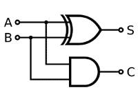
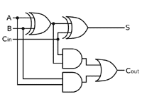
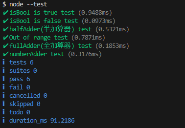

# JavaScriptで論理回路(半加算器)を使った整数の足し算を行う

## はじめに

久しぶり？に応用情報の勉強をしています(※)。

論理回路(半加算器、全加算器)を読んでいたら、足し算を使わない(半加算器のみ)で、足し算を行う関数を作りたくなったので作ってみました。

※早いものでソフトウェア開発技術者をとって20年以上経ちました。周りに資格取ってね、と言いふらしているのもあり、思い立って取得しようとしています。

## 半加算器 と 全加算器 について

### 半加算器(下位桁の繰り上がりを考慮しない、1bitの加算ロジック)

2進数(aとb)の加算

 * 計算結果(s)：a xor b
   * 値が異なる場合は1, 同じなら0(1,1なら繰り上がるので)
 * キャリー(c)：a and b
   * (1,1)の場合のみ繰り上がる




### 全加算器(下位桁の繰り上がりを考慮した、1bitの計算ロジック)

(a + b)の計算に、(前の桁の)キャリーを加算
* 半加算器2つ＋OR回路(2つのキャリーの和)で構成される

* 計算結果(s)：
  * aとbの加算結果に(前の桁の)キャリーを加算
* キャリー(c)
  * 2回の計算結果の繰り上がり計算で、どちらかが繰り上がったら



※図は[IT用語辞典](https://e-words.jp/w/%E5%85%A8%E5%8A%A0%E7%AE%97%E5%99%A8.html)から借用しました

### 複数bitで構成される整数値の加算方法

下位bitから順に全加算器で加算することで、整数の加算をすることができる

（回路図では加算器を直列につなげているが、プログラムでは1bitずつループで計算する）


## プログラム(logical-add.mjs)

JavaScriptで作りました

### 半加算器

```javascript
/**
 * 型チェックユーティリティー
 * ・boolean or 0 or 1 の場合trueを返す
 * @param {*} val
 * @returns {boolean}
 */
export function isBool(val) {
  return typeof val === 'boolean' || val === 0 || val === 1;
}

/**
 * 半加算器
 * ・計算結果: a xor b
 * ・キャリー：a and b
 * @param {boolean | 0 | 1} a
 * @param {boolean | 0 | 1} b
 * @returns [キャリー、計算結果]
 */
export function halfAdder(a, b) {
  if (!isBool(a) || !isBool(b)) {
    throw new Error('Parameter must be boolean');
  }
  const s = a ^ b;
  const c = a & b;
  // [キャリー、計算結果]
  return [c, s];
}
```

### 全加算器

```javascript
/**
 * 全加算器
 * @param {boolean | 0 | 1} a
 * @param {boolean | 0 | 1} b
 * @param {boolean | 0 | 1} ci
 * @returns [キャリー、計算結果]
 */
export function fullAdder(a, b, ci) {
  // (a + b)の計算に、(前の桁の)キャリーを加算したのが[計算結果]
  // キャリーは、上記2回の計算結果のキャリー同士のor
  const [c1, s1] = halfAdder(a, b);
  const [c2, s2] = halfAdder(ci, s1); // 計算結果＋前の桁のキャリー
  const co = c1 || c2;
  // [キャリー、計算結果]
  return [co, s2];
}
```

### 整数の加算

下位ビットから順に繰り上がり計算を行います

```javascript
/**
 * 整数(>0)の加算
 * ・全加算器を使い最下位ビットから1bitずつ計算する
 * @param {number} a
 * @param {number} b
 * @returns {number} 計算結果
 */
export function numberAdder(a, b) {
  // 大きい方の桁数(bit単位) ⇒(ループ回数)
  const digits = 32 - Math.min(Math.clz32(a), Math.clz32(b));
  // 計算結果のbit配列(逆順)
  const resultRevBit = [];
  let mask = 1;
  let carry = 0;
  for (let i = 0; i < digits; i++) {
    // 引数の指定桁を(bit)maskで取り出し、!!(2重否定)でboolean化
    const [c, s] = fullAdder(!!(a & mask), !!(b & mask), carry);
    mask = mask << 1;
    // キャリーを保存して上位桁の計算に渡す
    carry = c;
    resultRevBit.push(s);
  }
  // 最後のcarryを追加
  resultRevBit.push(carry);

  // bit配列を整数値に変換
  const added = resultRevBit.reduce((result, bit, index) => {
    return result + (bit << index);
  }, 0);

  return added;
}
```

## テストコード(test.js)

Node.jsの[Test runner](https://nodejs.org/api/test.htm)用テストコード

0以上の整数値の加算が正しく行われました
(Integer.Maxを超えるとオーバーフローするので最大そこまで)

```javascript
/**
 * 加算器テストコード
 * $ node --test
 */

import test from 'node:test';
import assert from 'node:assert';

import { isBool, halfAdder, fullAdder, numberAdder } from './logical-add.js';

test('isBool is true test', (t) => {
  assert.strictEqual(isBool(true), true);
  assert.strictEqual(isBool(false), true);
  assert.strictEqual(isBool(0), true);
  assert.strictEqual(isBool(1), true);
});

test('isBool is false test', (t) => {
  assert.strictEqual(isBool(-1), false);
  assert.strictEqual(isBool(2), false);
  assert.strictEqual(isBool(null), false);
  assert.strictEqual(isBool(undefined), false);
  assert.strictEqual(isBool('0'), false);
  assert.strictEqual(isBool('1'), false);
});

test('halfAdder(半加算器) test', (t) => {
  // 配列の比較はdeepStrictEqualを利用する
  assert.deepStrictEqual(halfAdder(0, 0), [0, 0]);
  assert.deepStrictEqual(halfAdder(1, 0), [0, 1]);
  assert.deepStrictEqual(halfAdder(0, 1), [0, 1]);
  assert.deepStrictEqual(halfAdder(1, 1), [1, 0]);

  assert.deepStrictEqual(halfAdder(false, false), [0, 0]);
  assert.deepStrictEqual(halfAdder(true, false), [0, 1]);
  assert.deepStrictEqual(halfAdder(false, true), [0, 1]);
  assert.deepStrictEqual(halfAdder(true, true), [1, 0]);
});

test('Out of range test', (t) => {
  assert.throws(() => {
    halfAdder(2, 0);
  });

  assert.throws(() => {
    halfAdder(1, null);
  });

  assert.throws(() => {
    halfAdder(1, '0');
  });
});

test('fullAdder(全加算器) test', (t) => {
  // 配列の比較はdeepStrictEqualを利用する
  assert.deepStrictEqual(fullAdder(0, 0, 0), [0, 0]);
  assert.deepStrictEqual(fullAdder(1, 0, 0), [0, 1]);
  assert.deepStrictEqual(fullAdder(0, 1, 1), [1, 0]);
  assert.deepStrictEqual(fullAdder(1, 1, 1), [1, 1]);

  assert.deepStrictEqual(fullAdder(false, false, true), [0, 1]);
  assert.deepStrictEqual(fullAdder(true, false, true), [1, 0]);
  assert.deepStrictEqual(fullAdder(false, true, false), [0, 1]);
  assert.deepStrictEqual(fullAdder(true, true, false), [1, 0]);
});

test('numberAdder test', (t) => {
  assert.strictEqual(numberAdder(0, 0), 0);
  assert.strictEqual(numberAdder(0, 1), 1);
  assert.strictEqual(numberAdder(1, 1), 2);
  assert.strictEqual(numberAdder(10, 5), 15);
  assert.strictEqual(numberAdder(15, 1), 16);
  // integer max
  assert.strictEqual(numberAdder(2_147_483_646, 1), 2_147_483_647);
  // overflow
  assert.notEqual(numberAdder(2_147_483_647, 1), 2_147_483_648);
});
```

## テスト実行結果


